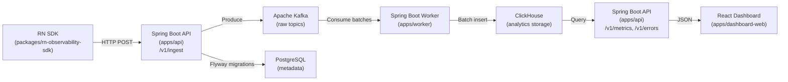

# Mobile Observability Platform

A production-style, single-developer MVP for React Native telemetry with an end-to-end, locally runnable pipeline.

## Architecture



## Project Structure

```
├── apps/
│   ├── api/                  # Spring Boot MVC collector + query API
│   ├── worker/               # Spring Kafka consumers + ClickHouse sink
│   └── dashboard-web/        # React + TypeScript (Vite) dashboard
├── packages/
│   ├── rn-observability-sdk/ # React Native TS SDK
│   └── mobile-sample/        # Example RN app
├── infra/
│   ├── kafka/                # Topic creation script
│   └── clickhouse/           # Init SQL schemas + rollups
├── scripts/                  # Seed & demo utilities
├── docker-compose.yml        # Single entrypoint for local dev
├── Makefile                  # Common commands
└── .github/                  # CI workflows, PR templates, labels
```

## Quickstart

### Prerequisites

- Docker & Docker Compose v2+
- Java 17+ (for Gradle builds)
- Node.js 20+ (for dashboard & SDK)

### 1. Start Infrastructure

```bash
# Start Postgres, ClickHouse, Kafka/Zookeeper, and Kafka UI
make infra-up

# Or start everything (infra + app services when available)
docker compose up -d

# Check containers are running
make ps
```

### 2. Verify Infrastructure

```bash
# Verify ClickHouse tables were created
make verify-ch

# Check Kafka topics in Kafka UI
open http://localhost:8080
```

### 3. Build & Test Java Modules

```bash
./gradlew :apps:api:test :apps:worker:test
```

### 4. Seed Demo Data

The seed script generates ~220 sessions (70% `v1.0.0` / 30% `v1.1.0`) with
realistic traffic: normal flows, slow-screen regressions, POST `/checkout`
latency spikes, and a burst of `NullPointerException` errors concentrated in
the last 2 hours of a 48-hour window.

**Prerequisites:** API, Kafka, ClickHouse, and the worker must all be running.

```bash
# Start everything first
docker compose up -d --build

# Find the API key — it is printed on API startup:
docker compose logs api | grep "API key"

# Run the seed (prompts for the API key, or set env var)
node scripts/seed-demo.mjs
# — or —
INGEST_API_KEY=mobo_xxxx node scripts/seed-demo.mjs

# Optional: override defaults
SESSION_COUNT=500 BATCH_SIZE=50 INGEST_API_KEY=mobo_xxxx node scripts/seed-demo.mjs
```

After the script finishes:

- **Kafka UI** at http://localhost:8080 shows traffic on `mobile.events.raw`, `mobile.api.raw`, `mobile.errors.raw`
- **ClickHouse** tables `mobobs.mobile_events`, `mobobs.mobile_api_calls`, `mobobs.mobile_errors` will have rows within a few seconds

Run the unit tests for the generator (no network required):

```bash
node --test scripts/seed-demo.test.mjs
```

### 5. Open Dashboard (after PR7)

```bash
open http://localhost:5173
```

## Infrastructure Services

| Service    | Port(s)          | Description                       |
| ---------- | ---------------- | --------------------------------- |
| Postgres   | `5432`           | Metadata store (Flyway managed)   |
| ClickHouse | `8123` / `9000`  | Analytics storage (HTTP / Native) |
| Kafka      | `9092` / `29092` | Event streaming (internal / host) |
| Zookeeper  | `2181`           | Kafka coordination                |
| Kafka UI   | `8080`           | Topic browser & consumer groups   |

### ClickHouse Schema

The `mobobs` database is auto-created on container start with these tables:

| Table              | Engine             | Description                           |
| ------------------ | ------------------ | ------------------------------------- |
| `mobile_events`    | ReplacingMergeTree | app_start, screen_view, custom events |
| `mobile_api_calls` | ReplacingMergeTree | API timing & status tracking          |
| `mobile_errors`    | ReplacingMergeTree | Handled & unhandled errors            |
| `mobile_sessions`  | ReplacingMergeTree | Session lifecycle                     |

Materialized view rollups (insert-time aggregation):

- `events_throughput_1m` — Event count per minute by type
- `api_latency_1m` — API request count, error count, duration stats per endpoint
- `error_rate_1m` — Error count per minute by class

> **Note:** `ReplacingMergeTree` provides eventual deduplication by `event_id` after background merges. Do not rely on it for strict uniqueness at query time.

## Make Commands

| Command           | Description                         |
| ----------------- | ----------------------------------- |
| `make up`         | Start all containers                |
| `make down`       | Stop all containers                 |
| `make ps`         | Show running containers             |
| `make infra-up`   | Start only infrastructure           |
| `make infra-down` | Stop only infrastructure            |
| `make infra-logs` | Tail infra logs                     |
| `make verify-ch`  | Verify ClickHouse tables exist      |
| `make logs`       | Tail API + worker logs              |
| `make build`      | Build Java modules                  |
| `make test`       | Run all Java tests                  |
| `make seed`       | Run seed demo script                |
| `make clean`      | Remove Docker volumes (destructive) |

## Data Pipeline

1. **RN SDK** captures events (app_start, screen_view, api_timing, error, custom_event)
2. **SDK** batches and POSTs to `/v1/ingest` on the collector API
3. **API** validates payloads, authenticates via API key, publishes to **Kafka** raw topics
4. **Worker** consumes batches from Kafka, inserts into **ClickHouse** tables
5. **API** query endpoints read from ClickHouse and return metrics/feeds
6. **React Dashboard** displays overview, errors, and API performance

## Kafka Topics

| Topic                 | Purpose                              | Partitions |
| --------------------- | ------------------------------------ | ---------- |
| `mobile.events.raw`   | app_start, screen_view, custom_event | 6          |
| `mobile.api.raw`      | api_timing                           | 6          |
| `mobile.errors.raw`   | error                                | 3          |
| `mobile.sessions.raw` | session lifecycle (optional)         | 3          |
| `*.dlq`               | Dead-letter queues                   | 3          |

## References

- **Spring Boot Web**: MVC (servlet stack) via `spring-boot-starter-web`; preferred for blocking JDBC
- **Spring MVC**: Annotated controllers with `@RestController` for request mapping
- **Bean Validation**: Constraint annotations (`@NotNull`, `@NotBlank`, etc.) enforced at runtime
- **Spring Kafka**: Batch listener DLQ pattern with `DefaultErrorHandler` + `DeadLetterPublishingRecoverer`; manual ack semantics
- **Kafka Producer**: Idempotence (`enable.idempotence=true`) and `acks=all` for safe retries
- **Flyway**: Versioned migrations (`V1__init.sql`); Spring Boot auto-runs on startup when Flyway is on the classpath
- **ClickHouse**: MergeTree `ORDER BY` as primary key expression; time partitioning; `LowCardinality(String)` for dimensions; `quantileTDigest` for percentiles; materialized views for rollups
- **ClickHouse JDBC**: Official JDBC driver for Java connectivity
- **React + Vite**: Recommended build tool for React apps built from scratch
- **React Native Fetch**: Built-in networking API for HTTP requests
- **React Navigation**: `useFocusEffect` for screen focus-based side effects
- **GitHub Actions**: YAML-defined workflow syntax for CI/CD
