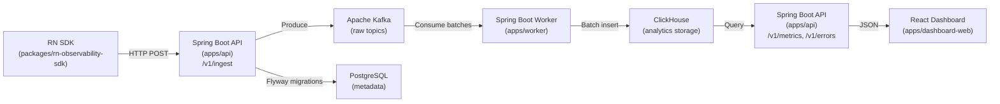

# MaizLogger — Mobile Observability Platform

A full-stack, end-to-end mobile observability platform built for React Native apps. It collects telemetry events from a React Native SDK, streams them through Apache Kafka, stores them in ClickHouse for analytics, and surfaces insights through a Spring Boot query API and a React dashboard. Alert rules evaluate key health metrics on a schedule and store firing events so operators can detect regressions quickly.

The entire stack runs locally via Docker Compose — no external services required.

## What It Does

- **Collects** app events from a React Native app (app start, screen views, API timing, handled/unhandled errors, and custom events) through a lightweight TypeScript SDK.
- **Ingests** event batches over HTTP to a Spring Boot collector API that authenticates via API key, validates payloads, and publishes them to Kafka raw topics.
- **Processes** Kafka messages in a Spring Boot worker that performs batch inserts into ClickHouse and routes poison messages to dead-letter queues.
- **Stores** analytics in ClickHouse using time-partitioned MergeTree tables and insert-time materialized view rollups for fast query performance.
- **Queries** aggregated metrics (overview totals, error feeds, API latency percentiles) through REST endpoints backed by ClickHouse.
- **Alerts** when error rate, p95 latency, or failed request counts breach configured thresholds; alert firings are stored in Postgres and exposed through an API feed.
- **Displays** live metrics on a React + TypeScript dashboard with overview, errors, and API performance pages.

## Key Features

| Feature            | Details                                                                                                   |
| ------------------ | --------------------------------------------------------------------------------------------------------- |
| Event types        | `app_start`, `screen_view`, `api_timing`, `error`, `custom_event`                                         |
| API key auth       | Prefix + bcrypt hash stored in Postgres; verified per request                                             |
| Kafka delivery     | At-least-once; idempotent producer (`acks=all`); 6-partition high-volume topics                           |
| Dead-letter queues | `DefaultErrorHandler` + `DeadLetterPublishingRecoverer`; 5 retries with backoff                           |
| ClickHouse storage | `ReplacingMergeTree` tables; time-partitioned; `LowCardinality` dimensions; `quantileTDigest` percentiles |
| Rollup views       | `error_rate_1m`, `api_latency_1m`, `events_throughput_1m` aggregated at insert time                       |
| Postgres metadata  | Flyway-managed schema; stores apps, API keys, alert rules, alert firings                                  |
| Alert evaluation   | Scheduled worker loop (60 s); suppresses repeat firings within 2 × window                                 |
| React Native SDK   | Batch flush, tracked fetch wrapper, error boundary integration, screen tracking via `useFocusEffect`      |
| Dashboard          | React + Vite SPA with overview, errors, and API performance pages and shared filter bar                   |

## Tech Stack

| Layer                 | Technology                                                     |
| --------------------- | -------------------------------------------------------------- |
| Collector & Query API | Java 17, Spring Boot 3 (MVC), Bean Validation, Jackson, Flyway |
| Event streaming       | Apache Kafka, Spring Kafka (batch listeners, manual ack)       |
| Analytics store       | ClickHouse (MergeTree + materialized views)                    |
| Metadata store        | PostgreSQL (Flyway migrations)                                 |
| Worker                | Spring Boot 3, Spring Kafka, ClickHouse JDBC, Spring Scheduler |
| Dashboard             | React 18, TypeScript, Vite                                     |
| Mobile SDK            | React Native, TypeScript                                       |
| Build                 | Gradle 8 (Kotlin DSL), multi-project monorepo                  |
| Local infra           | Docker Compose, Kafka UI, Zookeeper                            |

## Architecture



## Project Structure

```
├── apps/
│   ├── api/                  # Spring Boot MVC collector + query API
│   ├── worker/               # Spring Kafka consumers + ClickHouse sink
│   └── dashboard-web/        # React + TypeScript (Vite) dashboard
├── packages/
│   ├── rn-observability-sdk/ # React Native TS SDK
│   └── mobile-sample/        # Example RN app
├── infra/
│   ├── kafka/                # Topic creation script
│   └── clickhouse/           # Init SQL schemas + rollups
├── scripts/                  # Seed & demo utilities
├── docker-compose.yml        # Single entrypoint for local dev
├── Makefile                  # Common commands
└── .github/                  # CI workflows, PR templates, labels
```

## Quickstart

### Prerequisites

- Docker & Docker Compose v2+
- Java 17+ (for Gradle builds)
- Node.js 20+ (for dashboard & SDK)

### 1. Start Infrastructure

```bash
# Start Postgres, ClickHouse, Kafka/Zookeeper, and Kafka UI
make infra-up

# Or start everything (infra + app services when available)
docker compose up -d

# Check containers are running
make ps
```

### 2. Verify Infrastructure

```bash
# Verify ClickHouse tables were created
make verify-ch

# Check Kafka topics in Kafka UI
open http://localhost:8080
```

### 3. Build & Test Java Modules

```bash
./gradlew :apps:api:test :apps:worker:test
```

### 4. Seed Demo Data

The seed script generates ~220 sessions (70% `v1.0.0` / 30% `v1.1.0`) with
realistic traffic: normal flows, slow-screen regressions, POST `/checkout`
latency spikes, and a burst of `NullPointerException` errors concentrated in
the last 2 hours of a 48-hour window.

**Prerequisites:** API, Kafka, ClickHouse, and the worker must all be running.

```bash
# Start everything first
docker compose up -d --build

# Find the API key — it is printed on API startup:
docker compose logs api | grep "API key"

# Run the seed (prompts for the API key, or set env var)
node scripts/seed-demo.mjs
# — or —
INGEST_API_KEY=mobo_xxxx node scripts/seed-demo.mjs

# Optional: override defaults
SESSION_COUNT=500 BATCH_SIZE=50 INGEST_API_KEY=mobo_xxxx node scripts/seed-demo.mjs
```

After the script finishes:

- **Kafka UI** at http://localhost:8080 shows traffic on `mobile.events.raw`, `mobile.api.raw`, `mobile.errors.raw`
- **ClickHouse** tables `mobobs.mobile_events`, `mobobs.mobile_api_calls`, `mobobs.mobile_errors` will have rows within a few seconds

Run the unit tests for the generator (no network required):

```bash
node --test scripts/seed-demo.test.mjs
```

### 5. Query the Dashboard API

Three read-only endpoints expose ClickHouse analytics for the React dashboard:

| Method | Endpoint               | Description                                                        |
| ------ | ---------------------- | ------------------------------------------------------------------ |
| `GET`  | `/v1/metrics/overview` | Totals: events, sessions, errors, API calls, avg app-start latency |
| `GET`  | `/v1/errors/feed`      | Recent error feed, newest first                                    |
| `GET`  | `/v1/api/latency`      | API latency percentiles (p50 / p95 / p99) bucketed by hour         |

**Common query parameters** (all optional):

| Param     | Example                | Default      |
| --------- | ---------------------- | ------------ |
| `app`     | `demo`                 | all apps     |
| `env`     | `prod`                 | all envs     |
| `release` | `v1.1.0`               | all releases |
| `from`    | `2025-06-01T00:00:00Z` | 24 h ago     |
| `to`      | `2025-06-02T00:00:00Z` | now          |

`/v1/errors/feed` also accepts `limit` (default `50`, max `500`).
`/v1/api/latency` also accepts `path` (e.g. `/checkout`) and `method` (e.g. `POST`).

```bash
# Overview for prod over the last 24 h
curl "http://localhost:8081/v1/metrics/overview?app=demo&env=prod"

# Recent 20 errors for a specific release
curl "http://localhost:8081/v1/errors/feed?release=v1.1.0&limit=20"

# API latency for the checkout endpoint
curl "http://localhost:8081/v1/api/latency?path=/checkout&method=POST"
```

### 6. Open Dashboard (after PR7)

```bash
open http://localhost:5173
```

The dashboard serves three pages:

| Page            | Route              | Data source                                                                               |
| --------------- | ------------------ | ----------------------------------------------------------------------------------------- |
| Overview        | `/overview`        | `GET /v1/metrics/overview` — total events, sessions, errors, API calls, avg start latency |
| Errors          | `/errors`          | `GET /v1/errors/feed` — recent error feed with release/platform breakdown                 |
| API Performance | `/api-performance` | `GET /v1/api/latency` — p50/p95/p99 line charts per endpoint                              |

All pages share a filter bar (`app`, `env`, `release`, time window) that re-fetches data live.

### 7. Use the RN SDK (PR8)

Install from the monorepo (or publish to npm):

```bash
# Inside your React Native project
npm install @mobobs/rn-observability-sdk
```

#### Initialise the client

```ts
import {
	ObservabilityClient,
	createTrackedFetch,
	registerErrorHandlers,
	trackHandledError,
} from "@mobobs/rn-observability-sdk";

export const client = new ObservabilityClient({
	endpoint: "http://localhost:8000", // your API host
	apiKey: "mobo_xxxx", // printed by the API on startup
	appName: "MyApp",
	appVersion: "1.0.0",
	release: "v1.0.0",
	environment: "prod", // 'dev' | 'staging' | 'prod'
	platform: "ios", // or Platform.OS
	batchSize: 20, // flush every N events
	flushIntervalMs: 15_000, // flush every 15 s
});

// Wrap fetch so every request emits an api_timing event
export const http = createTrackedFetch(client);

// Register a crash handler for uncaught JS exceptions (React Native only)
registerErrorHandlers(
	client,
	() => navigationRef.getCurrentRoute()?.name ?? null,
);
```

#### Track events

```ts
// App start (call once, e.g. in the root component)
client.trackAppStart(coldStartMs);

// Screen view (call in useFocusEffect / NavigationContainer onStateChange)
client.trackScreenView("HomeScreen");

// Handled errors
try {
	await riskyOp();
} catch (e) {
	trackHandledError(client, e, "HomeScreen");
}

// Custom events
client.trackCustom("purchase_completed", { amount: 29.99, currency: "USD" });
```

#### Flush lifecycle

```ts
// In root component
useEffect(() => {
	client.startAutoFlush();
	return () => {
		void client.flush();
		client.stopAutoFlush();
	};
}, []);
```

#### Run SDK tests

```bash
cd packages/rn-observability-sdk
npm install
npm test          # 23 tests — client batching, trackedFetch timing
npm run build     # tsc --noEmit type-check
```

See `packages/mobile-sample/App.tsx` for a full wiring example.

### 8. Alert Rules Feed (PR9)

Three demo rules are seeded automatically by the API on first startup:

| Rule                 | Metric            | Threshold     | Window |
| -------------------- | ----------------- | ------------- | ------ |
| High Error Rate      | `error_rate`      | 10 errors/min | 5 min  |
| Slow p95 API Latency | `p95_latency_ms`  | 2000 ms       | 5 min  |
| High Failed Requests | `failed_requests` | 50 requests   | 5 min  |

The worker evaluates all enabled rules every 60 seconds and writes `alert_firings` to Postgres when a threshold is breached.

```bash
# List configured alert rules
curl "http://localhost:8000/v1/alerts/rules?app=demo-app"

# Recent alert firings (last 24 h by default)
curl "http://localhost:8000/v1/alerts/feed?app=demo-app&limit=20"

# Narrower time window
curl "http://localhost:8000/v1/alerts/feed?from=2025-06-01T00:00:00Z&to=2025-06-02T00:00:00Z"
```

To trigger demo alerts, run the seed script (which generates high error + latency spikes) then wait one evaluation cycle:

```bash
node scripts/seed-demo.mjs
# Wait ~60 s, then:
curl "http://localhost:8000/v1/alerts/feed?app=demo-app"
```

## Infrastructure Services

| Service    | Port(s)          | Description                       |
| ---------- | ---------------- | --------------------------------- |
| Postgres   | `5432`           | Metadata store (Flyway managed)   |
| ClickHouse | `8123` / `9000`  | Analytics storage (HTTP / Native) |
| Kafka      | `9092` / `29092` | Event streaming (internal / host) |
| Zookeeper  | `2181`           | Kafka coordination                |
| Kafka UI   | `8080`           | Topic browser & consumer groups   |

### ClickHouse Schema

The `mobobs` database is auto-created on container start with these tables:

| Table              | Engine             | Description                           |
| ------------------ | ------------------ | ------------------------------------- |
| `mobile_events`    | ReplacingMergeTree | app_start, screen_view, custom events |
| `mobile_api_calls` | ReplacingMergeTree | API timing & status tracking          |
| `mobile_errors`    | ReplacingMergeTree | Handled & unhandled errors            |
| `mobile_sessions`  | ReplacingMergeTree | Session lifecycle                     |

Materialized view rollups (insert-time aggregation):

- `events_throughput_1m` — Event count per minute by type
- `api_latency_1m` — API request count, error count, duration stats per endpoint
- `error_rate_1m` — Error count per minute by class

> **Note:** `ReplacingMergeTree` provides eventual deduplication by `event_id` after background merges. Do not rely on it for strict uniqueness at query time.

## Make Commands

| Command           | Description                         |
| ----------------- | ----------------------------------- |
| `make up`         | Start all containers                |
| `make down`       | Stop all containers                 |
| `make ps`         | Show running containers             |
| `make infra-up`   | Start only infrastructure           |
| `make infra-down` | Stop only infrastructure            |
| `make infra-logs` | Tail infra logs                     |
| `make verify-ch`  | Verify ClickHouse tables exist      |
| `make logs`       | Tail API + worker logs              |
| `make build`      | Build Java modules                  |
| `make test`       | Run all Java tests                  |
| `make seed`       | Run seed demo script                |
| `make clean`      | Remove Docker volumes (destructive) |

## Data Pipeline

1. **RN SDK** captures events (app_start, screen_view, api_timing, error, custom_event)
2. **SDK** batches and POSTs to `/v1/ingest` on the collector API
3. **API** validates payloads, authenticates via API key, publishes to **Kafka** raw topics
4. **Worker** consumes batches from Kafka, inserts into **ClickHouse** tables
5. **API** query endpoints read from ClickHouse and return metrics/feeds
6. **React Dashboard** displays overview, errors, and API performance

## Kafka Topics

| Topic                 | Purpose                              | Partitions |
| --------------------- | ------------------------------------ | ---------- |
| `mobile.events.raw`   | app_start, screen_view, custom_event | 6          |
| `mobile.api.raw`      | api_timing                           | 6          |
| `mobile.errors.raw`   | error                                | 3          |
| `mobile.sessions.raw` | session lifecycle (optional)         | 3          |
| `*.dlq`               | Dead-letter queues                   | 3          |

## References

- **Spring Boot Web**: MVC (servlet stack) via `spring-boot-starter-web`; preferred for blocking JDBC
- **Spring MVC**: Annotated controllers with `@RestController` for request mapping
- **Bean Validation**: Constraint annotations (`@NotNull`, `@NotBlank`, etc.) enforced at runtime
- **Spring Kafka**: Batch listener DLQ pattern with `DefaultErrorHandler` + `DeadLetterPublishingRecoverer`; manual ack semantics
- **Kafka Producer**: Idempotence (`enable.idempotence=true`) and `acks=all` for safe retries
- **Flyway**: Versioned migrations (`V1__init.sql`); Spring Boot auto-runs on startup when Flyway is on the classpath
- **ClickHouse**: MergeTree `ORDER BY` as primary key expression; time partitioning; `LowCardinality(String)` for dimensions; `quantileTDigest` for percentiles; materialized views for rollups
- **ClickHouse JDBC**: Official JDBC driver for Java connectivity
- **React + Vite**: Recommended build tool for React apps built from scratch
- **React Native Fetch**: Built-in networking API for HTTP requests
- **React Navigation**: `useFocusEffect` for screen focus-based side effects
- **GitHub Actions**: YAML-defined workflow syntax for CI/CD
