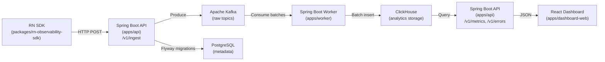

# Mobile Observability Platform

A production-style, single-developer MVP for React Native telemetry with an end-to-end, locally runnable pipeline.

## Architecture



## Project Structure

```
├── apps/
│   ├── api/                  # Spring Boot MVC collector + query API
│   ├── worker/               # Spring Kafka consumers + ClickHouse sink
│   └── dashboard-web/        # React + TypeScript (Vite) dashboard
├── packages/
│   ├── rn-observability-sdk/ # React Native TS SDK
│   └── mobile-sample/        # Example RN app
├── infra/
│   ├── kafka/                # Topic creation script
│   └── clickhouse/           # Init SQL schemas + rollups
├── scripts/                  # Seed & demo utilities
├── docker-compose.yml        # Single entrypoint for local dev
├── Makefile                  # Common commands
└── .github/                  # CI workflows, PR templates, labels
```

## Quickstart

```bash
# 1. Start all infrastructure
docker compose up -d

# 2. Build & test Java modules
./gradlew :apps:api:test :apps:worker:test

# 3. Start apps
docker compose up -d --build

# 4. Seed demo data (after PR5)
node scripts/seed-demo.mjs

# 5. Open dashboard
open http://localhost:5173
```

## Make Commands

| Command      | Description                          |
|-------------|--------------------------------------|
| `make up`   | Start all containers                 |
| `make down` | Stop all containers                  |
| `make logs` | Tail API + worker logs               |
| `make build`| Build Java modules                   |
| `make test` | Run all Java tests                   |
| `make seed` | Run seed demo script                 |

## Data Pipeline

1. **RN SDK** captures events (app_start, screen_view, api_timing, error, custom_event)
2. **SDK** batches and POSTs to `/v1/ingest` on the collector API
3. **API** validates payloads, authenticates via API key, publishes to **Kafka** raw topics
4. **Worker** consumes batches from Kafka, inserts into **ClickHouse** tables
5. **API** query endpoints read from ClickHouse and return metrics/feeds
6. **React Dashboard** displays overview, errors, and API performance

## Kafka Topics

| Topic                  | Purpose                              | Partitions |
|-----------------------|--------------------------------------|-----------|
| `mobile.events.raw`  | app_start, screen_view, custom_event | 6         |
| `mobile.api.raw`     | api_timing                           | 6         |
| `mobile.errors.raw`  | error                                | 3         |
| `mobile.sessions.raw`| session lifecycle (optional)         | 3         |
| `*.dlq`              | Dead-letter queues                   | 3         |

## References

- **Spring Boot Web**: MVC (servlet stack) via `spring-boot-starter-web`; preferred for blocking JDBC
- **Spring MVC**: Annotated controllers with `@RestController` for request mapping
- **Bean Validation**: Constraint annotations (`@NotNull`, `@NotBlank`, etc.) enforced at runtime
- **Spring Kafka**: Batch listener DLQ pattern with `DefaultErrorHandler` + `DeadLetterPublishingRecoverer`; manual ack semantics
- **Kafka Producer**: Idempotence (`enable.idempotence=true`) and `acks=all` for safe retries
- **Flyway**: Versioned migrations (`V1__init.sql`); Spring Boot auto-runs on startup when Flyway is on the classpath
- **ClickHouse**: MergeTree `ORDER BY` as primary key expression; time partitioning; `LowCardinality(String)` for dimensions; `quantileTDigest` for percentiles; materialized views for rollups
- **ClickHouse JDBC**: Official JDBC driver for Java connectivity
- **React + Vite**: Recommended build tool for React apps built from scratch
- **React Native Fetch**: Built-in networking API for HTTP requests
- **React Navigation**: `useFocusEffect` for screen focus-based side effects
- **GitHub Actions**: YAML-defined workflow syntax for CI/CD
